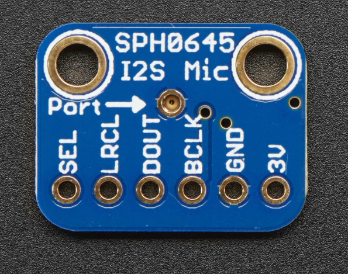
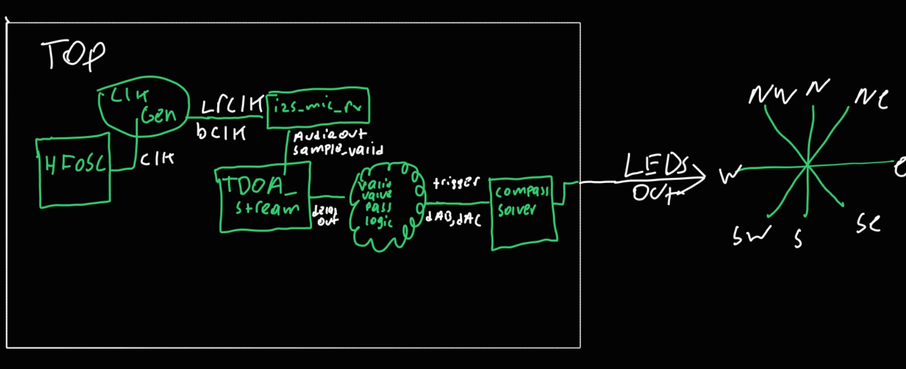

# ES4 Final Project: Sound Source Localization

This project implements a real-time acoustic direction-finding system that determines the compass direction of a sound source using three I2S MEMS microphones connected to an FPGA. The system displays the detected direction on eight LEDs representing the cardinal and intercardinal compass directions (N, NE, E, SE, S, SW, W, NW).

## Features

- Real-time sound source localization using Time Difference of Arrival (TDOA) algorithm
- Three I2S MEMS microphones for accurate triangulation
- 8-directional LED compass display
- FPGA-based implementation for low-latency processing
- Automated ROM generation for expected delay values

## Hardware Requirements

- **FPGA Board**: iCE40UP5K (Upduino 3.0)
- **Microphones**: 3x I2S MEMS Microphones
- **LEDs**: 8x LEDs for compass directions
- **Connections**: Appropriate wiring for I2S data lines and LED outputs

### Hardware Images




## Software Requirements

- **Apio**: FPGA development
- **Python 3.x**: For ROM generation script
- **NumPy**: Required for mathematical calculations in ROM generation within Python script

## Setup and Installation

1. Install Apio:
   ```bash
   pip install apio
   ```

2. Install required Python packages:
   ```bash
   pip install numpy
   ```

3. Clone or download this repository.

## Building and Programming

1. Navigate to the project directory:
   ```bash
   cd ES4-Final-Project-Sound-Source-Localization
   ```

2. Generate the ROM data (according to specific microphone setup):
   ```bash
   python ROM_gen.py
   ```
   This generates expected TDOA values for different compass directions.

3. Build the project:
   ```bash
   apio build
   ```

4. Program the FPGA:
   ```bash
   apio upload
   ```

## Usage

Once programmed, the FPGA will continuously:

1. Sample audio from the three microphones
2. Calculate time delays between microphone pairs using TDOA
3. Determine the most likely sound source direction
4. Light the corresponding LED on the compass display

The system operates in real-time, updating the direction display as the sound source moves.

## System Architecture

The system uses a Time Difference of Arrival (TDOA) approach:

- **Microphone A**: Reference microphone
- **Microphone B**: Second microphone for AB delay calculation
- **Microphone C**: Third microphone for AC delay calculation

Delays are calculated between A - B and A - C pairs, then compared against expected values for each compass direction.



## Module Descriptions

### `cgen.sv`
Clock generation module. We're working with an internal 48 MHz oscillator we described as the internal clock. We divide this down to reach a smaller clock such as 12 MHz to generate the I2S clocks:

- BCLK: 3 MHz
- LRCLK: 46.875 kHz

### `i2s_mic_rx.sv`
I2S receiver module for each microphone.

- Receives 32-bit I2S data on each LRCLK cycle
- Filters out DC bias from audio samples
- Outputs 16-bit signed audio data with validity flag

### `tdoa_stream.sv`
Time Difference of Arrival calculation module.

- Maintains circular buffers for reference and target audio samples
- Compresses audio to 4-bit (Sign + 3 MSB) to save FPGA resources
- Uses cross-correlation to find the lag (delay) that maximizes signal similarity

### `compass_solver.sv`
Direction determination logic.

- Compares measured delays against a pre-computed lookup table
- Calculates error scores for each of the 8 compass directions
- Applies score decay and bonuses to ensure stable LED output

### `top.sv`
Main system integration module.

- Instantiates the oscillator (SB_HFOSC) and all submodules
- Handles synchronization between microphone data streams
- Manages data flow from microphones to LED outputs

### `ROM_gen.py`
Python script for generating expected TDOA values.

- Models the physical coordinates of the microphones
- Calculates theoretical sample delays for sound sources at 8 cardinal directions
- Outputs Verilog code for the compass_solver lookup table

## Credits

**Team Members**: Jesse Flores, Dagbegnon Amouzou, Vicky Lin, Carlos Tierra 
**AI Assistance**: ChatGPT was used for Python script generation and math verification.

## References & Resources
Due to the multidisciplinary scope of this project, several external resources were consulted:

- **DSP Theory**: The Scientist and Engineer's Guide to Digital Signal Processing (Steven W. Smith) was referenced for cross-correlation and filter design concepts.
- **FPGA Design**: Various technical documentation and forums regarding SystemVerilog best practices, specifically for handling Clock Domain Crossing (CDC) and timing constraints.
- **Concepts**: Educational engineering channels (YouTube) were utilized to visualize high-level signal processing and acoustic physics concepts.

## Additional Documentation

Additional documentation can be found here: [Final Report](https://drive.google.com/file/d/1eM54u9z0JAbJ3aeXFwQRu_ESW7j4bbJ0/view?usp=sharing)
